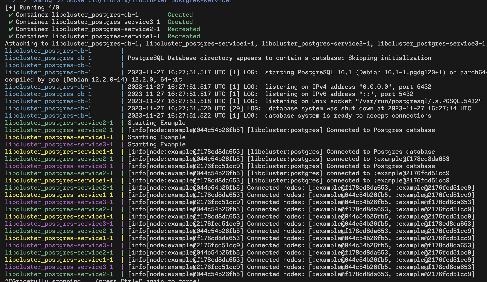

# Libcluster Postgres Strategy

Postgres Strategy for [libcluster](https://hexdocs.pm/libcluster/) which is used by Supabase on the [realtime](https://github.com/supabase/realtime) and [supavisor](https://github.com/supabase/supavisor) projects.

You can test it out by running `docker compose up`



## Installation

The package can be installed
by adding `libcluster_postgres` to your list of dependencies in `mix.exs`:

```elixir
def deps do
  [{:libcluster_postgres, "~> 0.1"}]
end
```

## How it works

We connect to a Postgres instance using Postgrex. With the [Postgrex.Notifications](https://hexdocs.pm/postgrex/Postgrex.Notifications.html) module we will track for `LISTEN` events on the configured channel. We'll also use `NOTIFY` queries to send the node's information.

## How to use it

To use it, set your configuration file with the informations for your database:

```elixir
config :libcluster,
  topologies: [
    example: [
      strategy: Cluster.Strategy.Postgres,
      config: [
          hostname: "localhost",
          username: "postgres",
          password: "postgres",
          database: "postgres",
          port: 5432,
          parameters: [],
          channel_name: "cluster"
      ],
    ]
  ]
```
Then add it to your supervision tree:

```elixir
defmodule MyApp do
  use Application

  def start(_type, _args) do
    topologies = Application.get_env(:libcluster, :topologies)
    children = [
      # ...
      {Cluster.Supervisor, [topologies]}
      # ...
    ]
    Supervisor.start_link(children, strategy: :one_for_one)
  end
end
```